# SumoRobotGuide
Um guia para começar da melhor forma nas competições de sumô de robôs.

*Então você quer começar a montar robôs de sumo né? Ótima escolha!*

## 🔗 Outros tópicos disponíveis
- 🛒 [Lojas recomendadas](./lojas.md)
- 💻 [Aplicativos](./apps.md)

## Super Resumo das regras

No sumô de robôs dois robôs disputam em uma arena circular chamada **Dohyo** com o objetivo de empurrar o adversário para fora. As disputas ocorrem em até 3 **rounds**, sendo o terceiro um desempate caso cada um esteja com um ponto. Vence o robô que obtiver 2 pontos de **Yuko**. Essa pontuação também pode ser obtida caso o adiversário cometa alguma infração (mais detalhes nas regras).

Regra mais atual em atividade no brasil:
[Regra2023](./Regras/Regras+-+Sumo_2023_RSM.pdf)  
**Fonte:** Site Robocore

## Categorias de sumô

As categorias de sumô são divididas por peso e dimenssões limite, e podem ser subdivididas em autônomo (**Auto**) ou rádio controlado (**RC**).

| Categoria         | variações | Diâmetro Dohyo | Peso Máximo     | Largura Máx. | Comprimento Máx. | Altura Máx. |
|-------------------|------|-----------|----------|---------------|---------------------|--------------|
| **Nano Sumo**     | Auto | 19,25 cm    | 25 g     | 2,5 cm        | 2,5 cm              | 2,5 cm       |
| **Micro Sumo**    | Auto | 38,5 cm   | 100 g    | 5,0 cm        | 5,0 cm              | 5,0 cm       |
| **Mini Sumo**     | Auto e RC | 77 cm   | 500 g    | 10,0 cm       | 10,0 cm             | Livre        |
| **Mega Sumo**     | Auto e RC | 154 cm    | 3 kg     | 20,0 cm       | 20,0 cm             | Livre        |
| **Sumo LEGO**     | Auto | 77 cm    | 1 kg     | 15,2 cm       | 15,2 cm             | Livre        |

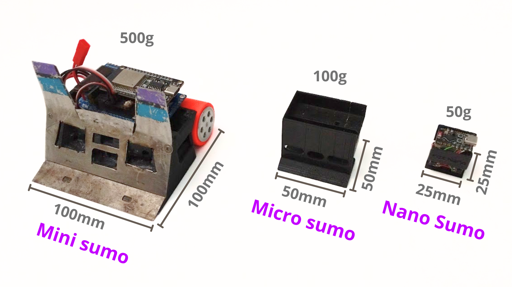

## Videos de demonstração

**obs:** esse video não esta acelerado :P  
[](https://www.youtube.com/watch?v=tBy5Q2gKjaw)


## Glossário

O sumô de robôs surgiu no japão então a maioria dos termos são em japones, vou destacar aqui os principais.

- **Dohyo**: é a Arena circular onde ocorrem as disputas.
- **Shikiri-sen**: Marcação proxima ao centro da arena que delimita onde os robôs podem ser posicionados.
- **Tawara**: Borda branca do dohyo que serve para indicar ao robô se esta proximo da borda.
- **Round**: Tempo no qual os dois robôs lutam um tentando empurrar o outro para fora
- **Yuko**: pontuação recebida, vence aquele que obtiver dois pontos **Yuko**.

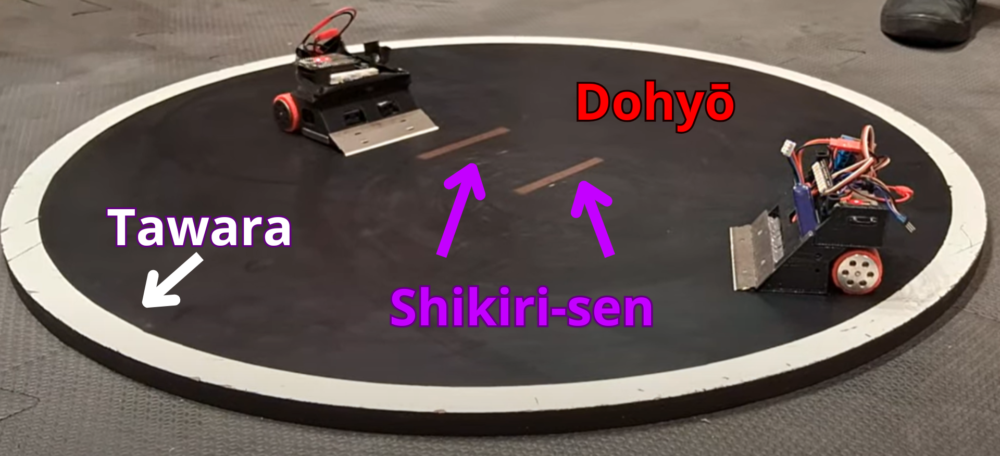


## 1 - Mini Sumo

Aviso: A seguir, focar um pouco mais no mini sumo porque é o robô que tenho mais experiência, mas boa parte da teoria se aplica as outras categorias com excessão de alguns tópicos relacionado ao MegaSumo, uma vez que ele usa imãs que alteram drasticamente sua dinâmica.

### X.X - Conceitos gerais

Existem alguns dilemas que são recorrentes no sumo. O objetivo do sumo é empurrar o outro adversário para fora, como realizar isso? A resposta não é unica! Ao longo do tempo foram surgindo algumas soluções e estratégias.

---

### Força 🦾

A primeira coisa que vem à cabeça no sumô é: **quem for mais forte, vence**. E de fato, um robô mais forte tem mais chances de empurrar o adversário para fora — mas essa força só é eficaz se algumas condições forem atendidas:

1. **É preciso alcançar o oponente.**  
   No caso de robôs rádio controlados, isso depende da habilidade do piloto. Já nos autônomos, é o conjunto de sensores e a estratégia embarcada no microcontrolador que define como o robô encontra e ataca o adversário.

2. **É preciso se manter em contato sem ser repelido.**  
   Imagine dois robôs em formato de caixa, sem rampas ou lâminas: qualquer contato permite empurrar o outro. Agora, se um deles tiver lâminas, espetos ou rampas mal posicionadas, pode acabar sendo rampado ou até virado ao fazer contato — o que abre espaço para estratégias mais elaboradas de combate.  


**Como ser “mais forte”?**  
   A força que o robô consegue aplicar depende diretamente da tração das rodas no chão. Essa força de tração é limitada pelo atrito — e se ele for superado, as rodas derrapam, desperdiçando energia.

A equação clássica do atrito é:

$$
F_{at} = N\mu
$$

Onde:  
- $F_{at}$ é a força de atrito máxima antes de derrapar;  
- $N$ é a força normal (basicamente o peso sobre a roda);  
- $\mu$ é o coeficiente de atrito entre roda e piso.

Portanto, para maximizar a força:
- Use **materiais com alto coeficiente de atrito** (como alguns silicones que chegam a $\mu = 1{,}7$ em madeira);
- **Aumente a normal nas rodas**, ou seja, distribua mais peso sobre elas.

Como a gravidade é constante, a única forma de aumentar a força peso ($P=mg$) é aumentar a **massa do robô** — daí a limitação de peso nas categorias, para manter a competição justa.

Por fim, é importante **equilibrar o peso** entre rodas e lâmina.  
O ideal é concentrar a maior parte da força normal nas rodas, mas manter uma fração na lâmina ajuda a mantê-la rente ao chão, melhorando a estabilidade e a capacidade de rampar o oponente. Mais detalhes sobre distribuição de peso na parte de estrutura.

---

### Rampagem

A "arte da rampagem" tem sido um dos grandes diferenciais entre os robôs atualmente. Às vezes, um robô nem precisa ser extremamente forte — se a sua rampa estiver bem nivelada, já pode ser suficiente para vencer muitos adversários.

Rampas são uma técnica inteligente de combate. Quando você consegue **rampar o robô adversário**, está, na prática, usando parte do peso dele contra ele mesmo! Ao ser rampado, o oponente perde tração nas rodas e, em certos casos, ao tentar empurrar de volta, só ajuda a se desequilibrar — ou até dar uma cambalhota.

Abaixo, destaquei 3 cenários comuns de rampagem, com base na posição do contato:

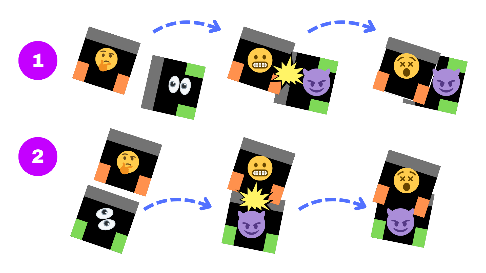

1. **Rampagem lateral e por trás**  
   São as situações (1) e (2). Nessas posições, o robô rampado está em grande desvantagem, já que são regiões sem laminas e pode ser dificil fazer um movimento para escapar da rampagem.

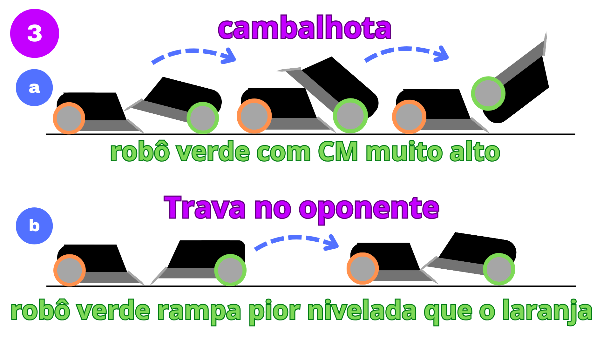

2. (3) **Rampa contra rampa**  
   Nesse caso, acontece um verdadeiro duelo de lâminas: vence quem estiver com o nivelamento mais preciso. Mas não é só isso — mesmo com um bom ajuste, é comum que existam regiões menos rentes ao chão, que acabam sendo os pontos mais vulneráveis. Aí entra um pouco de sorte… ou, no caso dos robôs RC, a experiência do piloto em saber como proteger seus pontos fracos e explorar os do adversário.

---

### 🔧 Como melhorar a rampagem:

- **Qualidade da lâmina**  
  Quanto mais afiada e flexível a lâmina, maior a chance de conseguir "entrar por baixo" do adversário. Materiais finos e resistentes são os mais indicados.

- **Nivelamento da lâmina**  
  Um bom nivelamento é essencial. Isso é feito posicionando a lâmina com fita dupla face e testando em superfícies planas (como vidro ou o próprio dohyo). Pequenas folgas podem ser o suficiente para perder rampagens.

- **Chassi bem nivelado**  
  Com o tempo, o chassi pode deformar, principalmente se for impresso em 3D. Isso atrapalha o nivelamento da lâmina. Impressão 3D é uma ótima opção para começar, mas se você busca mais consistência e durabilidade, vale considerar um chassi metálico ou feito com materiais mais rígidos.

---

### Recomendações de laminas

Na minha opnião existem 3 opções principais:

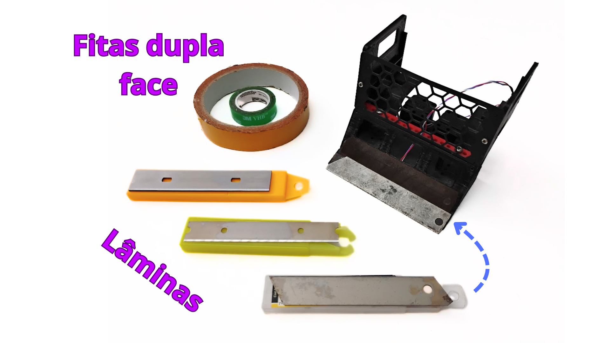  

1. **Laminas de Estilete 18mm:** não são tão flexiveis mas até que bem durávei. Excelente opção para quem esta começando, são baratas e as mais faceis de encontrar dessa lista. A desvantagem é que precisa cortar as pontas para não ultrapassar o limite da categoria. Para fazer isso recomendo cortar com uma microretifica usando um disco diamantado.

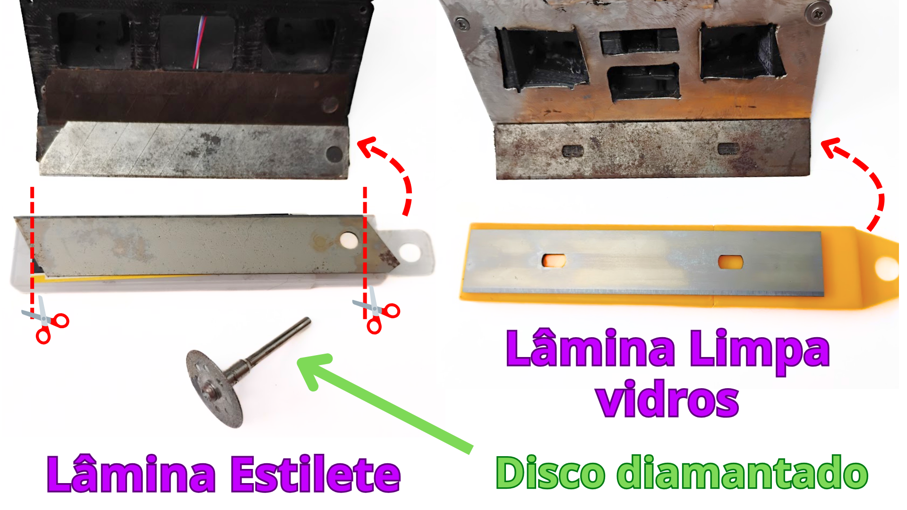

2. **Laminas de Limpa vidro 10mm:** Sim... existem laminas para limpar vidro doidera. É possivel encontrar no Aliexpress ou aqui no brasil essas laminas com 10mm exato, ideal pra mini sumo, ja que não precisa cortar. são mais flexiveie. No entanto, tenho a impressão que elas trincam mais na lamina em relação a de estilete. Se estiver muito trincada é hora de trocar.

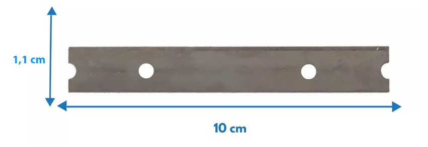

Existem muitos anuncios, alguns que encontrei:
[Aliexpress](https://pt.aliexpress.com/item/1005004493847873.html)  
[Mercado Livre](https://produto.mercadolivre.com.br/MLB-3320261529-lamina-raspador-espatula-10-cm-multiuso-compativel-bralimpia-_JM)  

3. **Laminas Kansawa:** São conhecidas como as melhores laminas para mini sumo, no entanto, mais dificeis e caras de se encontrar. Forjadas no japão por raposas encantadas (acredite ).

[Disponiveis na loja sumozade](https://www.sumozade.com/product/kanzawa-japan-black-mini-sumo-robot-blade)

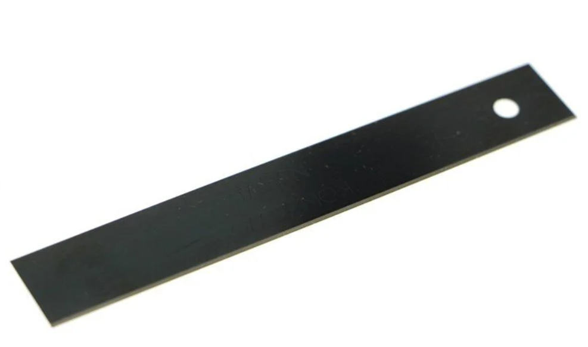


A arte da rampagem tem sido o grande diferêncial entre os robôs atualmente. As vezes você nem precisa de um robô muito forte se sua rampa estiver bem nivelada. Vamos começar pelo começo. As rampas são uma tecnica muito inteligente de combate, caso consiga rampar o robô adversário você consegue usar parte do seu peso contra ele! Quando um robô é rampado ele fica em uma posição desfavorável, onde a tração nas rodas é reduzida, e em algum casos a aplicação de força no robô inimigo só ajuda a dar cambalhota. Destaquei 3 possibilidades de rampagem em função da posição.


1. (1) rampagem lateral e (2) rampagem por tras. Em ambos os caso o robô adversário está em uma posição desfavorável porque na lateral e atras não existem rampas então são regiões faceis de serem rampadas.


2. (3) **Rampa contra rampa**  
   Nesse caso, acontece um verdadeiro duelo de lâminas: vence quem estiver com o nivelamento mais preciso. Mas não é só isso — mesmo com um bom ajuste, é comum que existam regiões menos rentes ao chão, que acabam sendo os pontos mais vulneráveis. Aí entra um pouco de sorte… ou, no caso dos robôs RC, a experiência do piloto em saber como proteger seus pontos fracos e explorar os do adversário. 

Como melhorar a rampagem:

- **Qualidade da lâmina:** Quanto mais afiada e flexivel a lamina mais facilmente ela penetra por baixo no robô adversário. 
- **Nivelamento da lâmina:** O nivelamento é realizado posicionando a lamina com fita duplaface no na frente do robô e testando. ... (terminar depois)
- **Chassi bem nivelada:** Com o tempo e uso o chassi pode envergar, dificultando o nivelamento da lamina. Chassis impressos costumam envergar com o tempo, mas são uma boa opção pra quem esta começando. Uma alternativa é usar chassis de metal que praticamente não invergam.


---
### Estrutura

---
### rodas

---
### Motores

---
### Velocidade

---
### Sensores


### 1.1 - "Anatomia" do robô

Irei Listar e dividir as peças para montar o robo em seções, tentarei ser o mais generalista possivel, cobrindo os tipos de robôs mais comuns. Alguns robôs podem escapar a essa classificação (e isso é ótimo! sinal que a categoria continua viva e trazendo inovações :P).

- **Sistema de locomoção:** Sistema responsável por fazer o robô se mover pelo dohyo, engloba as peças e circuitos relacionados a fazerem o robô se locomover. Em geral: rodas, motores, ESCs ou Pontes H.
- **Sistema de processamento:** Sistema responsável por fazer o robô se mover em função dos sinais do rádio, no caso rádio controlador, ou em função dos sinais dos sensores e estratégias de movimentação. Peças: microcontrolador / placa-mãe.
- **Alimentação:** Sistema repsonsavel por fornecer energia para o robô se mover e energizar suas placas e sensores.
- **Sensoriamento:** Conjunto de sensores utilizados no robô para identificar o ambiente, permitindo que ele identifique o robô adversário, tawara, etc.
- **Estrutura:** A estrutura responsável por manter as peças do robô no lugar desejado, e com o centro de massa no local desejado.
- **Sistemas de luta:** Elementos usados para dissoadir ou empurrar o robô adiversário. Exemplos mais comuns: Rampas, bandeiras e cordas. 
- **Rádio receptor:** Circuito que recebe os sinais do Rádio controle.

### 1.2 - Sistema de locomoção

O sistema de locomoção é responsável por fazer o robô se mover no dohyo. 99,9% dos projetos usam rodas por que é uma forma simples e eficiente de trasmitir o movimento dos motores para o robô, alguns raros projetos usam esteiras.

*porque não temos mini sumôs com pernas?*  
Teoricamente é possivel e permitido pelas regras. Apesar de ser muito legal não são adotados por dois motivos principais: Dificuldade de montar e eficiência em relação as rodas consseguem deixar o robô mais baixo e estavel, dificultando que ele seja virado.

| Sistema de locomoção |  dificuldade | eficiência | distribuição de masa |
|----------------------|-----------|------------|------------|
| 2 rodas com rampa na frente | facil | alta | boa parte do peso vai para as rodas proporcionado tração e o restante ajuda a manter a rampa rente ao chão. |
| 4 rodas ou duas esteiras com rampa na frente | médio por conta do espaço | alta | Praticamente todo o peso está nas rodas / esteiras resultando em mais tração e consequentemente força, mas acaba sendo pior para rampar pois não tem tanto peso na rampa para deixala rente ao chão. |
| pernas (hipotético) | alto | médio baixo (tendo em vista as técnicas atuais de combate que envolvem rampar e empurrar) |  |

### 1.2.1 - Sistema de locomoção diferêncial

Em robótica o sistema adotado nos sumôs é chamado de diferencial, nele dois conjunto motor e roda identicos são posicionadas de forma simétrica uma oposta a outra. desta forma temos 3 possibilidades de movimentos:

1. motores com velocidades iguais e mesmo sentido
2. motores com velocidades iguais e sentido oposto
3. motores com velocidades diferentes e mesmo sentido

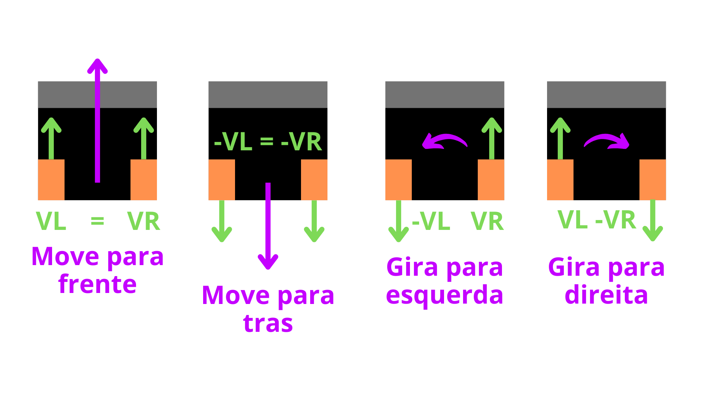
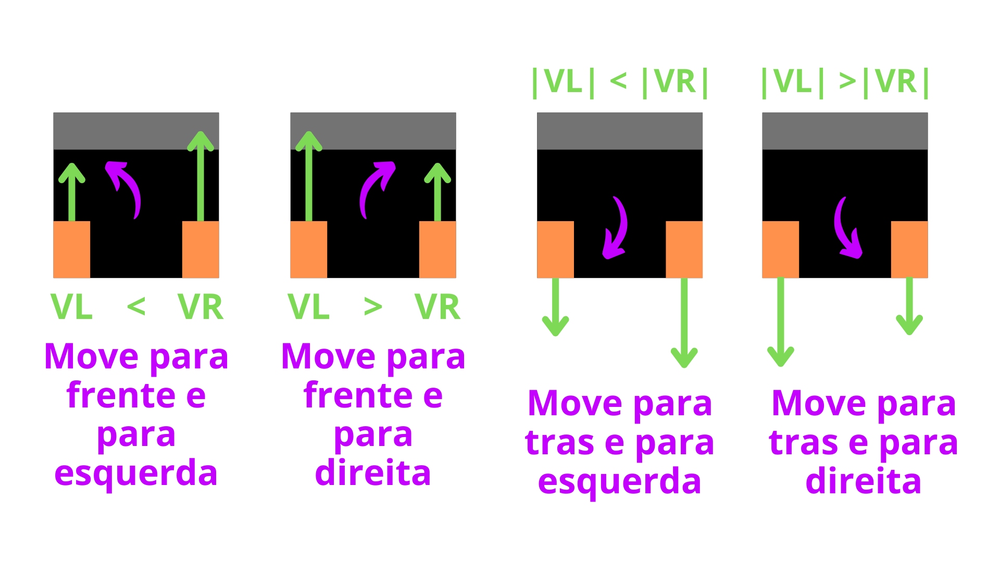

Perceba que essa disposição permite que o robo se mova em praticamente todas as direções exceto na diretação das roda, ou seja, um movimento lateral. Isso pode ser atingido com rodas omnidirecionais, mas não existem grandes vantagens no seu uso para sumo, em geral, esse sistema ja é o suficiente e funciona bem.

**Problemas dessa forma de locomoção:** Não da pra ganhar todas! O grande problema desse sistema aparece quando são aplicadas tensões iguais nos motores e ele deveria andar perfeitamente em linha reta mas não é oq acontece. A explicação pra isso se deve a asimetrias entre os dois lados do robô, como pequenas diferenças entre os raios da rodas, diferênças no motores (mesmo que tenha nascido da mesma fabrica um ao lado do outro) e diferenças na distribuição de peso entre as rodas.

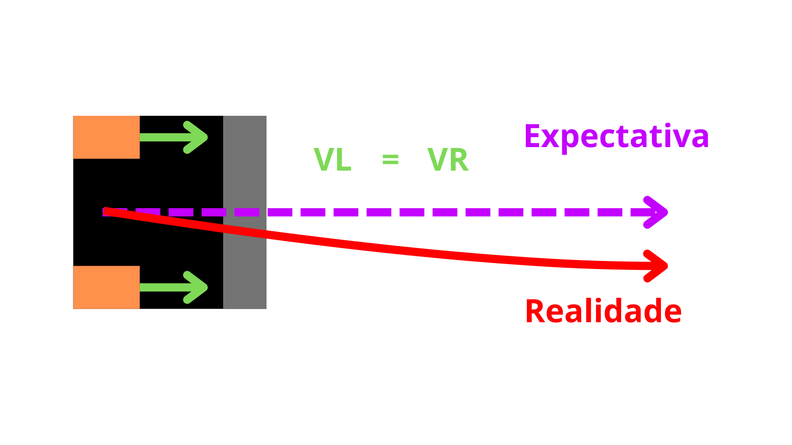

**Solução para o problema:**

1. Busque deixar o robô o mais simétrico possivel, de preferencia com motores e rodas do mesmo fabricante e um projeto que não acumule peso muito de um lado só. Não entre em panico se mesmo assim o robô anida estiver curvando, isso ajuda a reduzir o problema mas sempre haveram assimetrias.
2. Caso o seu robô seja radio controlado isso pode ser compensado no radio, de forma proporcional a velocidade da roda que estiver mais rápida. Com isso ja da pra melhorar bastante o restante é treino do piloto!
3. Caso o seu robô seja autonomo essa diferença não vai afetar muito o desempenho do robô porque geralmente o sensoriamento compensa essa diferênça. Por exemplo: imagine um robô com dois sensores virados para frente um do lado direito e um do esquerdo. Caso ele enxergue um robô na sua frente com os dois sensores ele se move para frente, no entanto como ele se move um pouco curvo uma hora um dos sensores vai parar de enxergar nesse instante a estratégia deve reduzir a velocidade do lado que esta exergando para curvar e manter o robô no seu campo de visão até que os dois voltam a enxergar e assim continua.
4. Solução chique: usar um giroscópio e um controlador que mede a diferença entre a rotação desejada e a rotação real, atuando para reduzir a diferênça a zero. (praticamente ninguém usa kkk mas se estiver bem calibrado funciona muuuito bem)

**Um pouco de matemática:**

Até o momento falei de forma intuitiva sobre o movimento do robô em função das velocidades das rodas. Agora vou ser um pouco mais analítico e apresentar algumas equações — sem me alongar demais. Neste modelo, o movimento é decomposto em velocidade linear de deslocamento ($v$) e rotação ($\omega$):

$$
v = \frac{v_R+v_L}{2}
$$

$$
\omega = \frac{v_R-v_L}{l}
$$

Onde:  
$v_L$ - Velocidade da roda esquerda em m/s.  
$v_R$ - Velocidade da roda direita em m/s.  
$v$ - velocidade linear (tangente à trajetória) em m/s  
$l$ - distancia entre as rodas em metros  
$\omega$ - velocidade angular (rotação em torno do centro entre as rodas) em rad/s  

Essas equações descrevem a oque é chamado em robótica de modelagem cinemática direta do robô, ou seja, elas decrevem o movimento final do robô em função do movimento dos atuadores, que reste caso são os motores das rodas.

Vamos testar essas equações:

1. se tiver uma velocidade de $1m/s$ nas duas rodas e $l=0,01\text{m}$:

$$
v = \frac{1+1}{2} = 1\text{ m/s}
$$

$$
\omega = \frac{1-1}{l} = 0\text{ rad/s}
$$

**ou seja:** o robô de move em linha reta para frente porque $v=1m/s$ positivo e sem fazer curva ja que $\omega = 0$

2. se tiver uma velocidade de $1m/s$ na roda direita e $-1m/s$ na esquerda com $l=0,01\text{m}$:

$$
v = \frac{1-1}{2} = 0 \text{ m/s}
$$

$$
\omega = \frac{1-(-1)}{0,01} = 200\text{ rad/s} \approx 1910 \text{ RPM}
$$

**ou seja:** o robô se rotaciona em torno do próprio eixo mas sem deslocamento.

Em resumo as equações descrevem bem o movimento esperado do robô em função das velocidades das rodas, mas não representam as imprefeições de montagem do robô, tenha isso em mente.  

Essas equações são uteis na mixagem do robô caso precise fazer. Ou caso queira se aprofundar no sistema de controle de movimentação do robô.

[Mais sobre modelagem cinemática de robôs diferenciais](https://www.cs.columbia.edu/~allen/F17/NOTES/icckinematics.pdf)

---

### 1.2.2 Rodas ou esteiras

As rodas ou esteiras são muito importantes para os sumôs, ela é responsavel por transmitir o movimento dos motores para o robô. Oque buscar em uma roda:

- Coeficiente de atrito: quanto maior o coeficiente de atrito melhor! Mais força é tranferida para o robô adversário sem derrapar.
$$
F \leq N_{\text{rodas}} \mu_{\text{estatico}} \text{ (caso sem derrapagem) }
$$
$$
F = N_{\text{rodas}} \mu_{\text{dinâmico}} \text{ (com derrapagem) }
$$
- Diametro: quanto menor o diametro melhor, para aproveitar melhor a força dos motores. No entanto, tenha em mente que para um mesmo motor quanto menor a roda mais força mas menos velocidade.

$$
F = \tau_{\text{motor}}/r_{\text{roda}}
$$
$$
v = r_{\text{roda}}\omega_{\text{motor}}
$$

Materiais:

**Pneus:** Geralmente são feitos de silicone que têm um excelente coeficiente de atrito, e são macios o suficiente para aderir bem ao dohyo.  

**Hub:** É o "núcleo" da roda, a peça que conecta o eixo do motor ao pneu, transmitindo o movimento. Geralmente são feitos de aluminio, alguns projetos usam de aço para almentar a inercia e a normal nas rodas. Elas também podem ser impressas em 3D, para baratear o projeto.

> ### 🛒 Onde adquirir?

**🇧🇷 No Brasil:**  
A [Robocore](https://www.robocore.net/busca/StickyMAX) vende tanto o hub em alumínio quanto os pneus com dois tipos de grau Shore (unidade que indica a maciez dos pneus).

**🌍 Fora do Brasil:**  
A [JSUMO](https://www.jsumo.com/silicone-wheel-sets) é uma loja bastante conhecida por peças de sumô. Eles oferecem rodas de vários diâmetros com hubs de aço ou alumínio. Dentre as que já testei, estão entre as que têm melhor atrito. As mais comuns são as de **33×20 mm**.

**🔧 Opções DIY:**  
Para os mais aventureiros, é possível fabricar os pneus usando silicone. Já fiz testes e, com paciência, dá pra obter resultados excelentes. O hub pode ser impresso em 3D.  
👉 [Veja esse tutorial completo](https://mcuoneclipse.com/2017/12/28/making-perfect-sticky-diy-sumo-robot-tires/) que compara vários tipos de rodas e mostra o processo de fabricação.


---

### 1.3 Estrutura

Fazendo o equilibrio dinâmico do robô, supondo que ele está andando em linha reta com velocidades iguais nas rodas e que não empina.

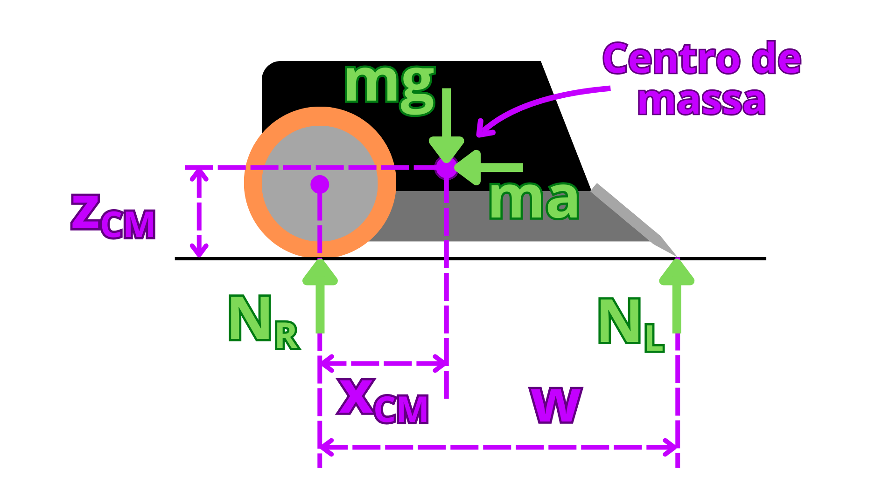

$$
mg = N_{\text{rodas}} + N_{\text{lâmina}}
$$

$$
ma = F_{\text{rodas}} - F_{\text{lâmina}}
$$

$$
0 = N_{\text{lâmina}}W + maz_{\text{CM}} - mgx_{\text{CM}}
$$

**onde:**

- $N$: força normal  
- $m$: massa do robô  
- $g$: aceleração da gravidade  
- $F$: forças horizontais  
- $W$: distância da roda até a ponta da lâmina  
- $x_{\text{CM}}, z_{\text{CM}}$: coordenadas do centro de massa  

conclusões sobre essas equações:

0. A terceira equação nos lembra que a normal é limitada ao peso do robô, a soma da normal nas rodas e na lamina é igual a força peso.

Se todo o peso estiver nas rodas o robô sera muito forte mas poderá empinar muito facilmente e a rampa não estaram tão rente ao chão. 

Mas se o peso estiver mais na rampa tera muito atrito na rampa e pouca tração nas rodas para ele se locomover. 

O ideal é balancear a normal, deixando um pouco mais nas rodas do que na rampa, não existe uma formula mágica mas algo em torno de cerca de 70% nas rodas e 30% na rampa pode dar bons resultados. Se chamar a proporção do peso nas rodas de $K_{\text{roda}}$

$$
mg = N_{\text{rodas}} + N_{\text{lâmina}}
$$

$$
N_{\text{rodas}} = K_{\text{roda}} mg
$$

$$
N_{\text{rodas}} = ( 1-K_{\text{roda}} ) mg
$$

$$
N_{\text{lâmina}}W = mgx_{\text{CM}} - maz_{\text{CM}}
$$

$$
( 1-K_{\text{roda}} ) = x_{\text{CM}}/W - (a/g)z_{\text{CM}}/W
$$

$$
 K_{\text{roda}} = \left(1 - \frac{x_{\text{CM}}}{W}\right) + a\left(\frac{z_{\text{CM}}}{gW}\right)
$$

1. A terceira equação descreve a condição para o robo não empinar. Caso $N_{\text{lâmina}}$ seja negativo o robô empinou.

$$
0 = N_{\text{lâmina}}W + maz_{\text{CM}} - mgx_{\text{CM}}
$$

No limite de empinar $N_{\text{lâmina}} = 0$ porque ele esta praticamente empinado então a normal na lamina tende a zero. Nesse caso a equação será:

$$
mgx_{\text{CM}} = ma_{\text{limite}}z_{\text{CM}}
$$

$$
a_{\text{limite}} = g\frac{ x_{\text{CM}} }{ z_{\text{CM}} }
$$

**Explicando:** essa equação descreve a aceleração máxima para que o robô não empine. ou seja, quanto menor o centro de massa menor $z_{\text{CM}}$ fazendo com que a aceleração limite seja maior e de preferencia impossivel de ser alcançada.

**Aprendizado:** Quanto menor o centro de massa e mais longe das rodas mais estavel. Como o centro de massa não pode estar muito distante da roda então a solução é reduzir sua altura.


### 1.X - Alimentação

A alimentação é realizada por baterias de LiPo, litio polimero. A tensão delas varia de 3,3V a 4,2V por célula. Em geral uma célula é não é o suficiente para robôs de mini sumô, por isso são usadas baterias de 2 ou 3S, onde S simboliza cada celula ligada em série. Desta forma uma bateria 2S varia de 2x3,3=6,6V até 2x4,2=8,4V e a 3S de 9,9V a 12,6V.

As baterias pode atingir tensões menores que 3,3V mas não é recomendado, porque abaixo disso não é saldavel para a bateria, podendo danificar de forma irreverssivel.

**Dica:** Sempre fique atento a tensão das baterias e de cada célula por dois motivos: monitorar se a bateria esta operando na faixa sauldave se valores (de 3,3v a 4,2 por celula) e segundo porque quanto menor a tensão menos energia para o robô se mover, reduzindo sua competitividade. Invista em baterias reservas para rápida reposição.

|categoria|Numero de calulas|Capacidade mais comum | 
|------------|----|---|
| Nano sumo  |  1 ~ 2S  | 60mAh  |
| Micro sumo |  2 ~ 3S  | 150mAh |
| Mini sumo  |  2 ~ 4S  | 330mAh |
| Mega sumo  |  6 ~ 12S | ? |


### 1.X - Sensores

...

### 1.X - Processamento

...

### 1.X - Rádio Controle

A comunicação radio controlada é composta por um Radio transmissor e um Receptor. Cada marca de rádio utiliza um protocolo diferente de comunicação, por exemplo a FlySky utiliza AFHDS e AFHDS-2A. Um protocolo define como os sinais são transmitidos e interpretados pelo receptor. Ao comprar um rádio é preciso observar qual protocolo ele utiliza e adquirir um receptor compativel.

#### FlySky FS-I6 e FS-I6X

Melhor custo beneficio para um rádio no estilo Aeromodelo. Considero uma otima opção de entrada para quem esta começando. Os modelos FS-I6 e FS-I6X são identicos a diferênça é que o X possui 10 canais e o sem X possui 6. Eles utilizam o protocolo AFHDS-2A.

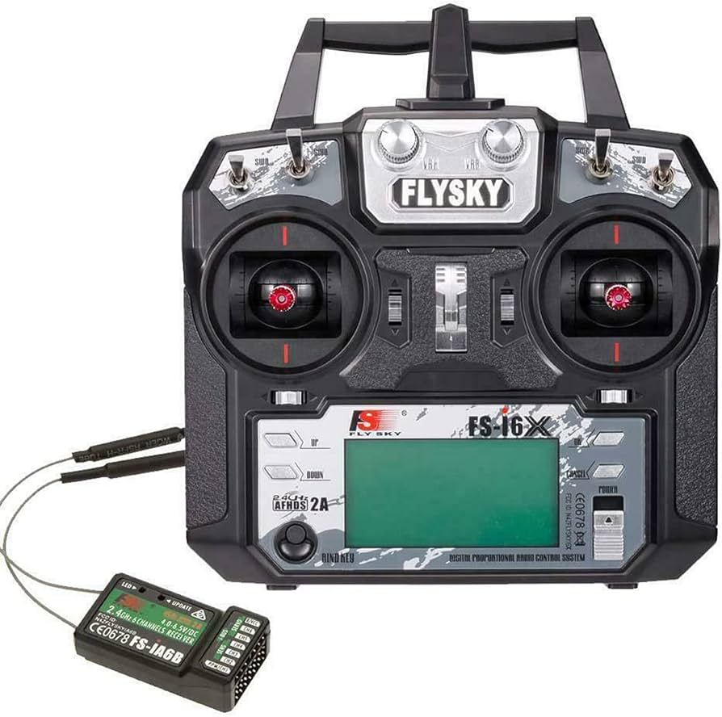

A própria FlySky vende vários tipo de receptores, com mais ou menos canais, com ou sem telemetria.

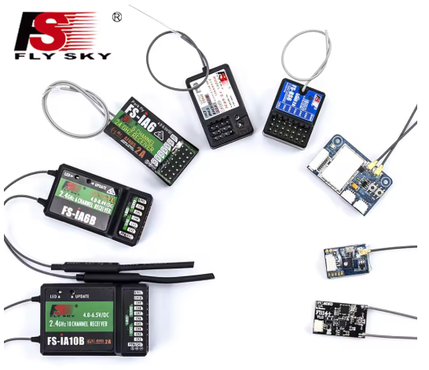

Existem também outros modelos, que não são da flysky, muito utilizados compativeis com AFHDS-2A.

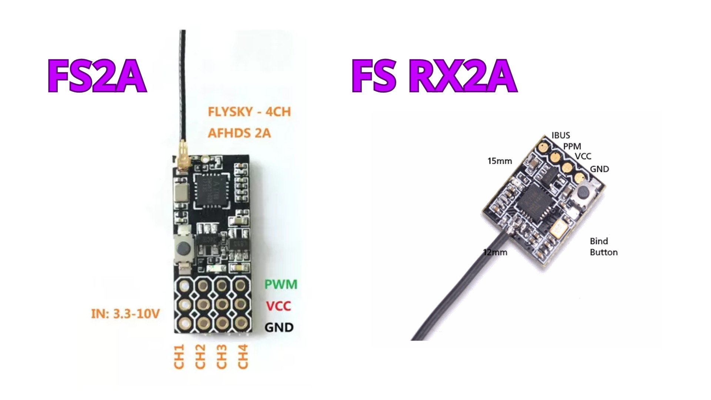

O FS2A é muito usado nas competições de robótica, ele possui 4 canais PWM e é muito pequeno oque ajuda muito no projeto. O FS-RX2A é menos utilizado ele não possiu saidas individuais para cada canal, todos os canais são transmitidos por um mesmo pino usando o protocolo PPM ou IBUS, são menos usados porque exigem decodificação do sinal para obter os canais individuais.

#### Radio pistola 2.4GHz TX-4

Os radios pistolas são opções muito interessantes para sumôs, muito pilotos proferem por ser mais intuitivo. O radio pistola possui um canal parececido com um gatilho que controla a velocidade do robô enquanto outro canal similar a um volante controla a rotação. O modelo 2.4GHz TX-4 é uma otima opção de baixo custo (cerca de 80 reais no aliexpress sem as taxas). Ele vem com um pequeno receptor de 4 canais. O unico problema é que ele possui poucas opções de ajuste dos canais, mas se estiver usando um arduino recebendo os sinais do receptor esses ajustes podem ser feitos no código.


#### ESPNOW

ESPNOW é um protocolo de comunicação remota em 2.4GHz da empresa Espressif, fabricante dos microcontroladores ESP. Esse protocolo permite comunicação bidirecionail rápida entre dois ou mais ESPs. Pode ser uma excelente opção para quem quer ter um projeto enxuto sem a necessidade de um receptor.

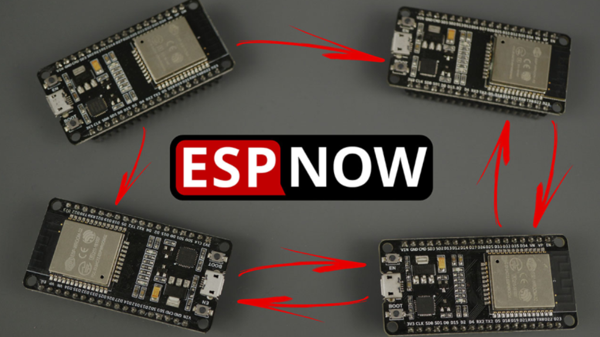

[Tutorial introdutório sobre ESPNOW](https://randomnerdtutorials.com/esp-now-esp32-arduino-ide/)

**Vantagens:**
- Muito barato, precisa apenas de um ESP no receptor e um ESP no transmissor  
- O projeto fica menor porque dispensa o receptor avulso.  
- Pode ser feita telemetria, para medir tensão da bateria, corrente etc.  

**Desvantagens:**
- Se não lidar bem com as interrupções de recebmento de pacotes podem acontecer alguns comportamentos inseperados, é recomendado usar uma biblioteca ou se tiver conhecimento em programação de microcontroladores ficar atento a isso e testar bastante antes de usar  
- O rádio teria que ser feito usando um ESP, apesar de terem inumeros projetos abertos dependendo os sticks utilizados a qualidade pode ficar muito ruim. **Fuja dos modus de joystick baratinhos!**  

**Minha experiencia com ESPNOW:**  

Gosto muito do protocolo ESPNOW devido a sua simplicidade na montagem do robô. Ultimamente é o protocolo que tenho adotado nos meus robôs. Desenvolvi uma biblioteca que facilita o uso [ESPNOW_device](https://github.com/luisf18/ESPNOW_device) ela realiza a conexão usando nome e senha (a senha ainda não terminei de implementar 😅), que é mais facil que a conexão por MAC.  

Eu montei meus radios modificando radios prontos e colocando um ESP no lugar da controladora.   

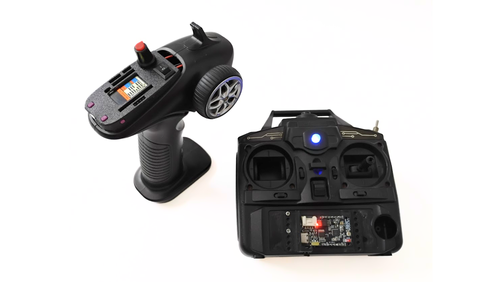

*"E se eu não quero fazer um rádio?"* Te entendo, fazer um rádio da trabalho. Pensando nisso fiz um conversor de PPM para ESPNOW. Ele é conectado na parte de tras do rádio na porta **Trainner** ou internamente. Ele recebe os sinais do rádio e converte para ESPNOW.

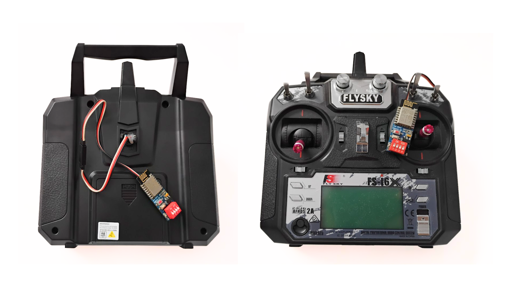
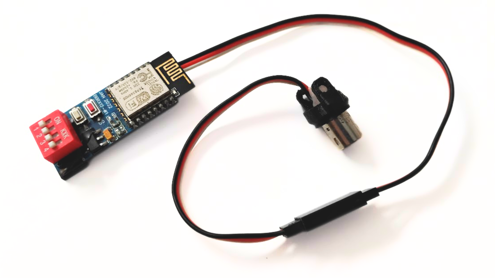

#### Bluetooth

Bluetooth é um famoso protocolo de comunicação remota que opera na faixa de 2.4GHz. Muitos dispositivos utilizam esse protocolo, inclusive controles remotos de jogos como PS4 e PS3 e smartphones.

### Usando um controle de PS3 ou PS4 como rádio:

Algumas equipes utilizam esses controles para conntrolar seus robôs. Exitem bibliotecas prontas que facilitam seu uso. A recepcção dos sinais é feita por uma microcontrolador que aceite o protocolo **Bluetooth Classic** que é diferente do **BLE** fique atento a isso. Em geral é utilizado o microntrolador ESP32, os microcontroladores mais novos da Espressif não possuem **Bluetooth classic** apenas **BLE** (como o ESP32-C3 e S3).


🧑🏼‍💻 ótimo Tutorial em português ensinando como fazer: https://www.youtube.com/watch?v=hXP_kQ_EbkA

### Usando um celular como controle remoto:

Usar um celular como controle pode ser uma otima solução para uma primeira competição, apesar de não ser muito confortavel funciona haha. Existem varios aplicativos ja prontos com sticks na tela e botões que transmitem via bluetooth o sinal deles.  


**Algumas sugestões de aplicativos para controle remoto**

1. [Arduino Bluetooth Controller](https://play.google.com/store/apps/details?id=com.giristudio.hc05.bluetooth.arduino.control&hl=pt_BR)

2. [BT Car Controller-Arduino/ESP](https://play.google.com/store/apps/details?id=com.giristuido.bluetooth.car.controller&hl=pt_BR)

**Aplicativo util para debug e escolha de estrtégia**
1. [Serial Bluetooth Terminal](https://play.google.com/store/apps/details?id=de.kai_morich.serial_bluetooth_terminal&hl=pt_BR)

**Como receber o sinal:**  
O sinal é recebido por uma placa ou micrcontrolador com **Bluetooth Classic** (Alguns aplicativos também trabalham com **BLE** cheque antes de comprar sua placa). Também existem modulos bluetooth como HC-05 para android e HC-06 para IOS. No entanto, atualmente compensa mais um ESP32 que ja recebe e processa os sinais.

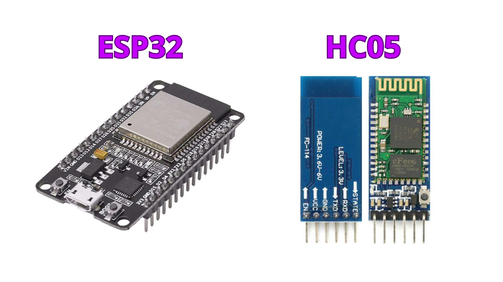

### Mixagem

A mixagem é o processo de misturar os sinais de dois canais para gerar dois sinais distintos ou apenas um. Isso é importante porque geralmente os pilotos preferem ter um canal que controla a velocidade e outro que controla a rotação e isso exige mixagem. As figuras abaixo mostram as escolhas de canais mais comuns, lembrando que oque vale para o flysky também pode ser aplicado usando o PS4 ou o celular. **OBS:** a utlima forma praticamente ninguém usa.

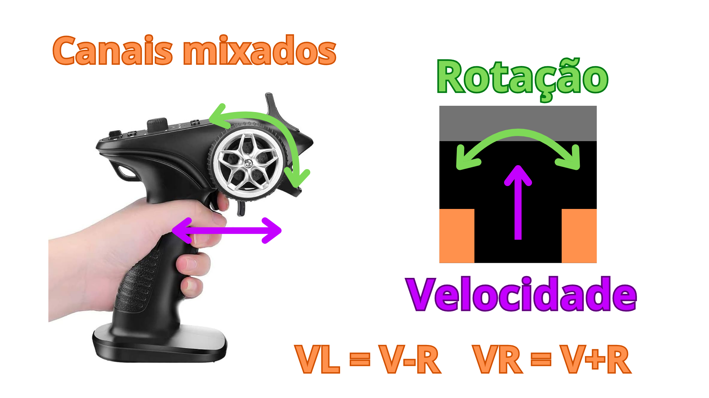
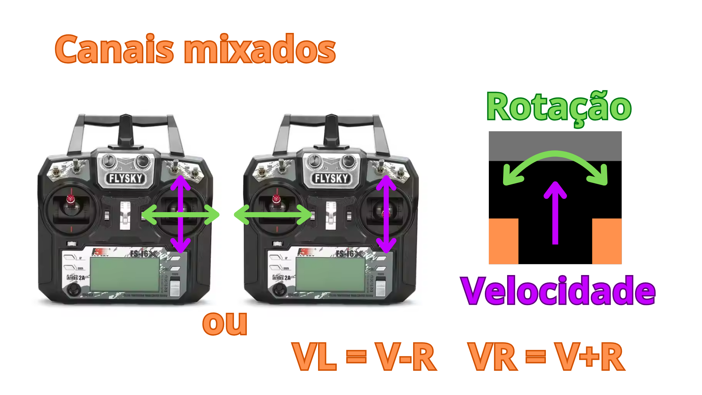
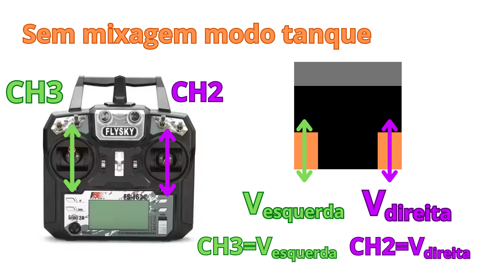

**Como mixar?**

**Rádio comprado:** Em radios comprados geralmente é possivel fazer mixagem e ajustes de sinais na propria interface do rádio (com telas e/ou botões), ou conectando o radio ao computador e usando um aplicativo para isso.

**Mixagem no ESC:** Alguns ESCs de dois canais possuem a funcionalidade de mixagem embutida, geralmente ela é ativada curtocircuitando um jumper no verso da placa. Neste o esc cuida da mixagem não sendo preciso realizala no rádio.

**Mixagem por microcontrolador:** Alguns projetos não utilizam ESCs e sim pontes H simples com um microcontrolador. Nesse caso a mixagem pode ser feita no rádio ou no próprio microcontrolador e é bem facil. Vou explicar um pouquinho da onde vêm as equações, se quiser pode pular pro código.

As equações para mixagem resultam da modelagem cinemática inversa, que é o jeito chique de chamar o processo de obter as equações que descrevem as velocidades dos atuadores em função das velocidades finais do robô (velocidade tangencial e de rotação). Elas são obtidas manipulando as equações da cinemática direta (obtidas anteriormente) e deixando em evidencia as velocidades de cada roda. ótima sugestão de trabalhindo de casa 📝🏠.

A Formula de mixagem precisa ficar considerar os limites que são ultrapassados nas quinas, por isso essas condições:

$$
v_r =
\begin{cases}
2000 & \text{se } ch_2 + ch_1 - 1500 > 2000 \\
1000 & \text{se } ch_2 + ch_1 - 1500 < 1000 \\
ch_2 + ch_1 - 1500 & \text{caso contrário}
\end{cases}
$$

$$
v_l =
\begin{cases}
2000 & \text{se } ch_2 - ch_1 + 1500 > 2000 \\
1000 & \text{se } ch_2 - ch_1 + 1500 < 1000 \\
ch_2 - ch_1 + 1500 & \text{caso contrário}
\end{cases}
$$

**Código**

o código abaixo funciona num Arduino ou ESP com os canais CH1 e CH2 conectados em dois pinos. 

```cpp

void radio_update(){
    
    // Leitura do sinal PWM
    int ch1 = pulseIn(CH1_PIN, HIGH, 25000); // Canal de rotação (ex: stick horizontal)
    int ch2 = pulseIn(CH2_PIN, HIGH, 25000); // Canal de velocidade (ex: stick vertical)

    // limita o sinal
    ch1 = constrain(ch1, 1000, 2000);
    ch2 = constrain(ch2, 1000, 2000);

    // Mixagem
    int vr = constrain(ch2 + ch1 - 1500, 1000, 2000); // Roda direita
    int vl = constrain(ch2 - ch1 + 1500, 1000, 2000); // Roda esquerda

    // [Opcional] Converter as velocidade em sinal PWM para ponte H
    // onde PWM_MAX é o valor máximo de PWM: 255, 1023...
    vr = map( vr, 1000, 2000, -PWM_MAX, PWM_MAX );
    vl = map( vl, 1000, 2000, -PWM_MAX, PWM_MAX );

    // Enviar para os motores ou PWM conforme sua lógica
    setMotorRightSpeed(vr);
    setMotorLeftSpeed(vl);
}
```

Adicionar futuramente exemplos completos:
- Arduino + HC05 + celular
- Arduino + Receptor + flysky (com pulsein)
- Arduino + Receptor + flysky (com interrupt)
- ESP32 + Bluetooth + Celular
- ESP32 + ESPNOW
