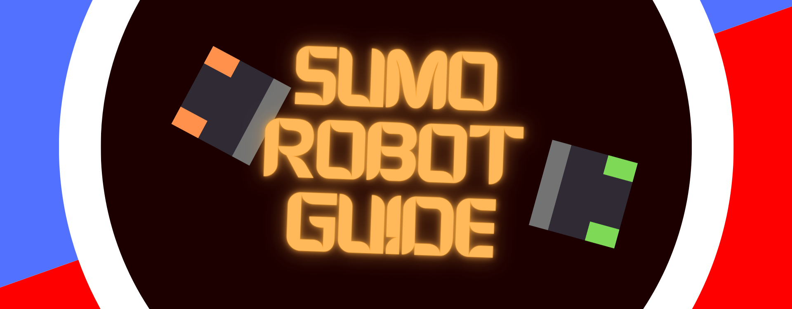
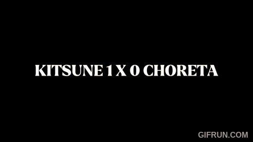
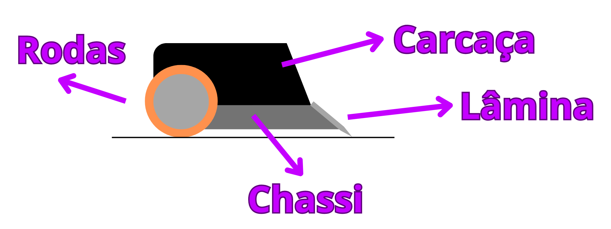

# SumoRobotGuide

Um guia para começar da melhor forma nas competições de sumô de robôs.

*Então você quer começar a montar robôs de sumô né? Ótima escolha!*

## 🔗 Outros tópicos disponíveis

### 📚 Capítulos

- [Força](./tutoriais/force.md)
- [Laminas e Rampagem](./tutoriais/blade.md)
- [Rodas](./tutoriais/wheels.md)
- [Baterias](./tutoriais/power.md)
- [Rádio comunicação](./tutoriais/radio.md)

### 🚧 Capítulos em desenvolvimento

- [Controle do Juiz](./tutoriais/ir_remote.md)
- [Motores e seus drivers](./tutoriais/motors.md)
- [Estratégias](./tutoriais/strategy.md)
- [Estrutura](./tutoriais/struct.md)
- [Sensores](./tutoriais/sensors.md)
- [Sistema de locomoção e cinemática](./tutoriais/kinematics.md)

### Outros
- 🛒 [Lojas recomendadas](./lojas.md)
- 💻 [Aplicativos](./apps.md)
- 📖 [Artigos academicos](./tutoriais/articles.md)

## Introdução

### Super Resumo das regras

No sumô de robôs dois robôs disputam em uma arena circular chamada **Dohyo** com o objetivo de empurrar o adversário para fora. As disputas ocorrem em até 3 **rounds**, sendo o terceiro um desempate caso cada um esteja com um ponto. Vence o robô que obtiver 2 pontos de **Yuko**. Essa pontuação também pode ser obtida caso o adiversário cometa alguma infração (mais detalhes nas regras).

Regra mais atual em atividade no brasil:
[Regra2023](./Regras/Regras+-+Sumo_2023_RSM.pdf)  
**Fonte:** Site Robocore

### Categorias de sumô

As categorias de sumô são divididas por peso e dimenssões limite, e podem ser subdivididas em autônomo (**Auto**) ou rádio controlado (**RC**).

| Categoria         | variações | Diâmetro Dohyo | Peso Máximo     | Largura Máx. | Comprimento Máx. | Altura Máx. |
|-------------------|------|-----------|----------|---------------|---------------------|--------------|
| **Nano Sumo**     | Auto | 19,25 cm    | 25 g     | 2,5 cm        | 2,5 cm              | 2,5 cm       |
| **Micro Sumo**    | Auto | 38,5 cm   | 100 g    | 5,0 cm        | 5,0 cm              | 5,0 cm       |
| **Mini Sumo**     | Auto e RC | 77 cm   | 500 g    | 10,0 cm       | 10,0 cm             | Livre        |
| **Mega Sumo**     | Auto e RC | 154 cm    | 3 kg     | 20,0 cm       | 20,0 cm             | Livre        |
| **Sumo LEGO**     | Auto | 77 cm    | 1 kg     | 15,2 cm       | 15,2 cm             | Livre        |

### Videos de demonstração

**obs:** esse video não esta acelerado :P  

  
[Video mini sumo](https://www.youtube.com/watch?v=vj_HQ1thTB0)

### Glossário

O sumô de robôs surgiu no japão então a maioria dos termos são em japones, vou destacar aqui os principais.

- **Dohyo**: é a Arena circular onde ocorrem as disputas.
- **Shikiri-sen**: Marcação proxima ao centro da arena que delimita onde os robôs podem ser posicionados.
- **Tawara**: Borda branca do dohyo que serve para indicar ao robô se esta proximo da borda.
- **Round**: Tempo no qual os dois robôs lutam um tentando empurrar o outro para fora
- **Yuko**: pontuação recebida, vence aquele que obtiver dois pontos **Yuko**.

### Aspectos gerais

> ⚠️ Aviso:  
> Esta seção foca um pouco mais na categoria **mini sumô**, pois é onde tenho mais experiência prática. No entanto, boa parte dos conceitos e estratégias também se aplicam às outras categorias — com exceção de alguns pontos específicos do **Mega Sumô**, que usa **ímãs**, alterando drasticamente sua dinâmica.

No sumô, o objetivo é: **empurrar o adversário para fora da arena**. Mas a forma de alcançar isso varia bastante, e é aí que a coisa fica interessante!

Com o tempo, diferentes soluções e estratégias foram surgindo. Um dos dilemas mais comuns — especialmente no **Mega Sumô** — é o clássico **Força vs Velocidade**. Mas existem muitos outros elementos que influenciam no sucesso de um robô: **estratégia**, **rampagem**, **sensoriamento**, uso de **bandeiras**, **cordas**, e muito mais.

Abaixo estão os principais aspectos que moldam um bom robô de sumô:

- **Força**  
- **Velocidade**  
- **Estratégia**  
- **Sensoriamento** (Autonomo ou RC semi-autonomo)  
- **Rampa** ou elementos como bandeiras, espetos e mecanismos criativos  
- **Treinamento** — tanto no modo autônomo quanto rádio controlado, para fazer as melhores escolhas em combate

> *Com esses aspectos já dá pra montar as cartinhas de Super Trunfo!* 😂

---

### Principais sistemas e peças

Aqui estão os principais conjuntos de peças que compõem um robô de sumô. A ideia é ser o mais generalista possível, cobrindo os formatos mais comuns — mas é sempre ótimo quando surgem designs fora do padrão (sinal de que a categoria está viva e inovando!).

- **Sistema de locomoção:**  
  Responsável pelo movimento do robô. Inclui rodas, motores, e os circuitos que controlam esses motores (como ESCs ou pontes H).

- **Sistema de processamento:**  
  Controla o comportamento do robô com base nos sinais do rádio (modo RC) ou dos sensores e estratégias programadas (modo autônomo). Normalmente feito por um microcontrolador ou placa de controle.

- **Alimentação:**  
  Fornece energia para todo o sistema, incluindo motores, sensores e lógica. Normalmente é feito com baterias LiPo.

- **Sensoriamento:**  
  Conjunto de sensores que ajudam o robô a entender o ambiente, detectando o adversário, a borda do dohyo (tawara), etc.

- **Estrutura:**  
  Parte mecânica que mantém todas as peças no lugar e posiciona corretamente o centro de massa.

- **Sistemas de combate:**  
  Elementos destinados a **dissuadir** ou **empurrar** o adversário. Exemplos: rampas, bandeiras, cordas e outros mecanismos.

- **Receptor de rádio:**  
  Responsável por receber os sinais do rádio controle no caso de robôs RC.

---
