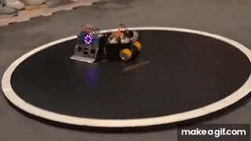
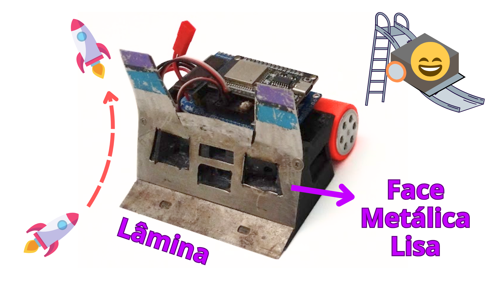
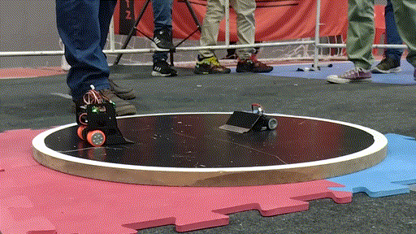
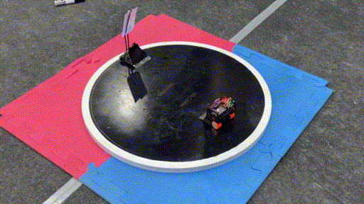
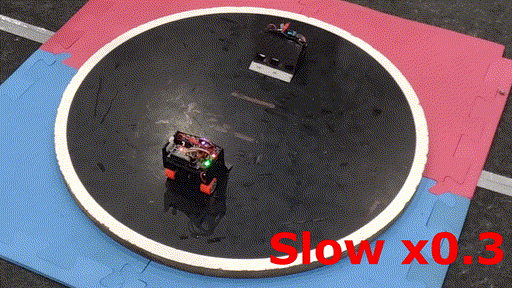
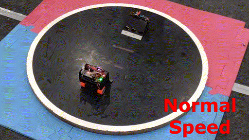

# Lâminas e Rampagem

A "arte da rampagem" tem sido um dos grandes diferenciais entre os robôs atualmente. Às vezes, um robô nem precisa ser extremamente forte — se a sua rampa estiver bem nivelada, já pode ser suficiente para vencer muitos adversários.

Rampas são uma técnica inteligente de combate. Quando você consegue **rampar o robô adversário**, está, na prática, usando parte do peso dele contra ele mesmo! Ao ser rampado, o oponente perde tração nas rodas e, em certos casos, ao tentar empurrar de volta, só ajuda a se desequilibrar — ou até dar uma cambalhota.

---

## Cenários de Rampagem

Abaixo, destaquei 3 cenários comuns de rampagem, com base na posição do contato entre os robôs:

### 1. **Rampagem lateral e por trás**  

São os casos (1) e (2). Nessas posições, o robô atacado está em grande desvantagem, já que essas regiões geralmente **não possuem lâminas** sendo facilmente rampadas.  
Além disso, a resposta costuma ser limitada:
- É difícil perceber o ataque a tempo, especialmente na traseira;
- Há **pouco espaço para manobrar**, e em alguns casos, o robô perde o contato das rodas com o chão, ficando completamente indefeso;
- No caso lateral, quando o atacante tem pouca força, os robôs podem entrar em um movimento de **rotação lateral contínuo**, presos num tipo de "dança" ao redor do dohyo. Girando em círculo até que um deles saia ou o juiz reinicie o round.

  
   
  Rampagem lateral mal sucedida, resultando em <B>rotação lateral</B>.

---

### 2. (3) **Rampa contra rampa**  

Nesse caso, acontece um verdadeiro duelo de lâminas: vence quem estiver com um melhor **nivelamento**. Mas não é só isso — mesmo com um bom ajuste, é comum que existam regiões menos rentes ao chão, que acabam sendo os pontos mais vulneráveis.

> A experiência do piloto (no caso de robôs RC) e o conhecimento do próprio robô fazem muita diferença nessa disputa.

#### (3-a) Capotagem do oponente  
O robô atacado pode deslizar pela rampa do adversário e virar — uma cambalhota. Segundo as regras, um robô virado perde automaticamente o round.

**Fatores que favorecem a capotagem:**

- **Do lado do robô atacado:**  
  Centro de massa muito alto torna o robô mais instável e fácil de virar.
  
- **Do lado do robô atacante:**  
  Superfícies metálicas lisas na "face" do robô ajudam o oponente a escorregar e desequilibrar.

> ⚠️ **Aviso:** Cuidado as vezes um robô rampa o outro e ele passa por cima dele, **não capota**. Para impedir que isso ocorra prolongue a chapa metalica frontal e de preferência faça uma pequena dobra para impedir que o robô passe por cima.

  
   
  Mesmo rampando perfeitamente o robô rampado acaba passando por cima dele e ganhando.

#### (3-b) Robôs travados entre rampas  
O contato entre as rampas pode gerar um **encaixe** ou travamento. Nessa situação, o desfecho depende de:
- Força de tração;
- Torque dos motores;
- Estratégia de movimentação.

Esse impasse pode resultar em:
- Um dos robôs com mais torque empurra o outro para fora.
- Movimento de **rotação lateral contínuo**: similar ao caso **(1)**, o contato entre as rampas pode não ser perfeitamente frontal, o que pode gerar esse movimento circular, onde os robôs giram em círculo até que um deles saia do dohyo ou o juiz reinicie o round.
- Uma manobra de escape ou reataque bem executada.

  
   
  Rampagem frontal com rampa travada no outro robô.

  
   
  Rampagem efetiva em camera lenta. Mesmo o robô escapando da primeira rampagem o atacante foi mas rápido e acaba rampando por trás.

  
   
  O mesmo em velocidade normal.

---

## 🏃‍♂️ Como escapar de uma rampagem

Escapar de uma rampagem é possível — mas nem sempre fácil. Em geral, a **velocidade**, **manobrabilidade** e **tempo de resposta** são seus maiores aliados. Abaixo, estratégias práticas para cada tipo:

---

### 🔙 Caso (1) — Rampagem por trás

É o cenário mais difícil de escapar:

- Tente se mover **para frente e para a lateral** rapidamente, se houver espaço;
- Mas atenção: o contato pode levantar suas rodas do chão, anulando sua tração e capacidade de moviemntação;
- Robôs autônomos raramente têm sensores traseiros, então podem tentar adotar movimentos evasivos programados.

---

### ↩️ Caso (2) — Rampagem lateral

Ainda há chance de resposta:

- Avançar em diagonal oposta ao atacante ou girar no sentido contrário ao empurrão pode ser a chave para escapar da rampa.
---

### ⚔️ Caso (3-b) — Rampa contra rampa (travada)

Esse caso exige **paciência e estratégia**:

- Execute uma pequena **ré para sair do encaixe** e **reatacar com mais energia cinética**;
- Isso pode gerar impulso suficiente para vencer o impasse;
- Evite empurrões contínuos que apenas mantêm o travamento ou favorecem a rotação em círculo.

---

🧠 **Resumo:**  
**Velocidade**, **posicionamento**, e um bom plano de reação são suas melhores armas contra uma rampagem.  
Mesmo em situações críticas, uma manobra bem executada pode mudar completamente o rumo da batalha.

---

## Como melhorar a rampagem:

- **Qualidade da lâmina**  
  Quanto mais afiada e flexível a lâmina, maior a chance de conseguir "entrar por baixo" do adversário. Materiais finos e resistentes são os mais indicados.

- **Nivelamento da lâmina**  
  Um bom nivelamento é essencial. Isso é feito posicionando a lâmina com fita dupla face e testando em superfícies planas (como vidro ou o próprio dohyo). Pequenas folgas podem ser o suficiente para perder rampagens.

- **Chassi bem nivelado**  
  Com o tempo, o chassi pode deformar, principalmente se for impresso em 3D. Isso atrapalha o nivelamento da lâmina. Impressão 3D é uma ótima opção para começar, mas se você busca mais consistência e durabilidade, vale considerar um chassi metálico ou feito com materiais mais rígidos.

---

## 🔪 Recomendações de lâminas

Na minha opinião, existem três opções principais de lâminas que funcionam bem em mini sumôs:

1. **Lâminas de estilete 18 mm**  
   São uma ótima opção para quem está começando. Fáceis de encontrar, baratas e relativamente duráveis. Embora não sejam muito flexíveis, cumprem bem o papel.  
   A principal desvantagem é que elas ultrapassam o limite de 10 cm da categoria mini sumô, então é necessário cortar as pontas. Para isso, recomendo usar uma microretífica com disco diamantado — o corte fica mais limpo e seguro.

---

2. **Lâminas de limpador de vidro (10 mm)**  
   Sim, isso realmente existe — lâminas para raspadores de vidro! 😄  
   São fáceis de encontrar no AliExpress ou até no Mercado Livre, e têm exatamente 10 mm de largura — o que as torna perfeitas para mini sumô, pois dispensam cortes.  
   São um pouco mais flexíveis que as de estilete, o que ajuda na rampagem, mas parecem trincar mais facilmente. Se notar muitas trincas, é hora de trocar.

**Alguns anuncios que encontrei:**  
- [AliExpress](https://pt.aliexpress.com/item/1005004493847873.html)  
- [Mercado Livre](https://produto.mercadolivre.com.br/MLB-3320261529-lamina-raspador-espatula-10-cm-multiuso-compativel-bralimpia-_JM)

---

3. **Lâminas Kanzawa**  
   Consideradas as melhores lâminas para mini sumô — feitas com acabamento impecável e excelente desempenho.  
   Mais difíceis de encontrar e com preço mais elevado, mas são extremamente afiadas, resistentes e já vêm prontas para uso. Forjadas no Japão por raposas encantadas 🦊 (acredite se quiser).

[Disponíveis na loja Sumozade](https://www.sumozade.com/product/kanzawa-japan-black-mini-sumo-robot-blade)

