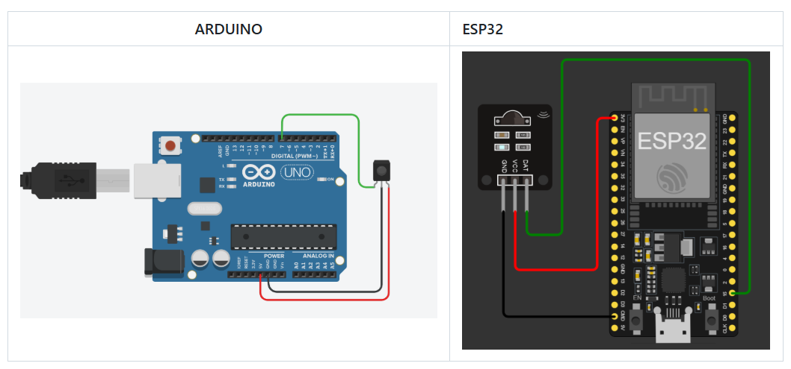

# Acionamento do Robô Autônomo (Controle do Juiz)

## 📜 Como era antes…

Antigamente, os robôs autônomos eram acionados **manualmente** pelos operadores. O juiz dava a largada e cada competidor clicava no botão de início.  
O robô então aguardava **5 segundos** antes de se mover. Se queimasse a largada, o competidor levava **advertência**. 👎

---

## Como é hoje

Atualmente, o acionamento dos robôs é feito **pelo juiz**, usando um **controle remoto infravermelho** com **protocolo SONY**.  
Com isso, os dois robôs iniciam **ao mesmo tempo** e assim que o juiz pressiona o botão, trazendo mais justiça para ambos os lados.  

---

## Especificação do Controle IR

O controle utilizado deve seguir o **protocolo SONY**. Esse protocolo define como os dados são codificados e enviados por meio de **pulsos de luz infravermelha**, geralmente a 38 kHz.

Apenas **três teclas** do controle são utilizadas nas competições:

| Tecla (Nome)       | O que o robô deve fazer                                                             | Quando pode ser acionada                         |
|--------------------|-------------------------------------------------------------------------------------|--------------------------------------------------|
| **1 – PREPARE (Preparar)** | O robô deve indicar que está pronto e recebendo comandos. Geralmente pisca um LED enquanto o botão está pressionado, e para quando solto. Também é permitido apenas acender um LED fixo, mas isso dificulta saber se ainda está recebendo. | Pode ser acionado a partir dos estados STOP ou PREPARE |
| **2 – START (Iniciar)**    | O robô deve iniciar o código de combate e acender outro LED de forma contínua para indicar que está ativo. | Só pode ser acionado se o robô estiver em PREPARE |
| **3 – STOP (Parar)**       | O robô deve desligar imediatamente seus motores e apagar os LEDs, indicando parada completa. | Pode ser acionado a qualquer momento              |

> ⚠️ **Atenção:**  
> Se o seu robô **não responder** ao comando do juiz (start ou stop), você pode ser advertido ou até perder a pontuação do round.

> 💡 **Dica:** Durante a preparação, garanta que o seu robô está recebendo o sinal corretamente. Quando o juiz pressionar o botão **PREPARE**, ele perguntará se os robôs estão prontos. Se o seu robô **não estiver indicando que está recebendo**, peça para o juiz ajustar a posição do controle. É comum ele movê-lo até encontrar um ângulo que funcione bem para os dois robôs.

---

## 🛍️ Onde conseguir o controle?

Você **vai precisar de um** para testar seu robô!  
- Procure por **controles de TV da Sony**, ou aproveite algum controle antigo.  
- Também existem modelos dedicados ao sumô, com **múltiplos emissores**, que ajudam a atingir os dois robôs com maior consistência.

  

### Outros modelos usados em competições:

Alguns torneios usam controles em formato de **pistola com laser**, permitindo que cada operador aponte diretamente para seu robô. O juiz ativa todos simultaneamente.

---

## 📥 Receptor infravermelho

Você pode:

### 1. Usar um **módulo pronto**, como:

- 🔌 [Módulo START da JSUMO](../img/jsumo_start.png)  
- 🦊 [Módulo IR da Fox Dynamics](../img/fox_start.png)

Eles já fazem a **decodificação do sinal SONY** e fornecem uma **saída digital** (HIGH ou LOW) simples para o microcontrolador.

---

### 2. Montar seu próprio receptor com sensor IR de 38 kHz

O mais comum é usar o sensor **VS1838** ou similar.

Esses sensores **reconhecem o padrão de 38 kHz**, e demodulam o sinal, transmitindo sinais digitais para o microcontrolador.  
Se você tiver experiência com programação de microcontroladores em baixo nivel, pode fazer a decodificação manual — ou usar bibliotecas como a `IRremote` para Arduino:

📦 [Link para a biblioteca IRremote](https://github.com/z3t0/Arduino-IRremote)

  

[exemplo de codigo]

---

## 🚨 Interferência de sinal

Os **controles remotos IR** e a maioria dos **sensores de oponentes** utilizados em robôs de sumô operam com **luz infravermelha**.  
Como ambos usam o mesmo tipo de luz, é comum haver **interferência** entre eles durante as partidas.

### ⚠️ O que pode acontecer:
- O robô **não reconhece** o sinal de START ou STOP enviado pelo juiz.  

### ✅ Soluções práticas para evitar interferência:
- ~~Mudar as regras~~ 😅  
- Aponte o **receptor IR para cima**, pois o sinal do juiz normalmente vem de cima da arena.
- Coloque **proteções laterais** no sensor (como uma capinha impressa em 3D ou fita isolante preta), para bloquear a luz dos sensores dos oponentes.
- 🚫 Evite deixar o receptor **exposto na frente do robô**, onde ele pode ser atingido diretamente pela luz dos outros sensores.

---

## 🧪 Minhas experiências

> Apesar dos módulos prontos da JSUMO serem fáceis de usar e muito populares, **em TODAS as competições que fui, sempre teve alguém com problema no acionamento por causa de interferência**. Eu, desde o começo, optei por usar **sensores IR discretos (VS1838)**. Tirando vacilos de código, **nunca tive grandes problemas**.
