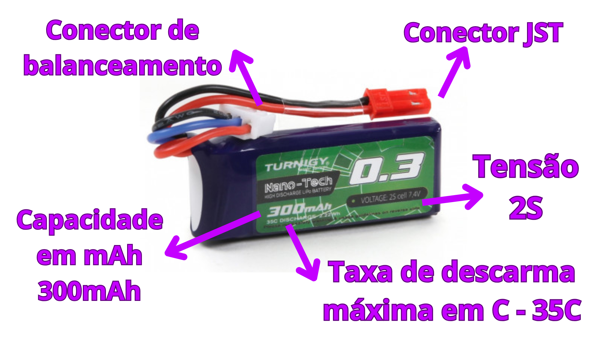
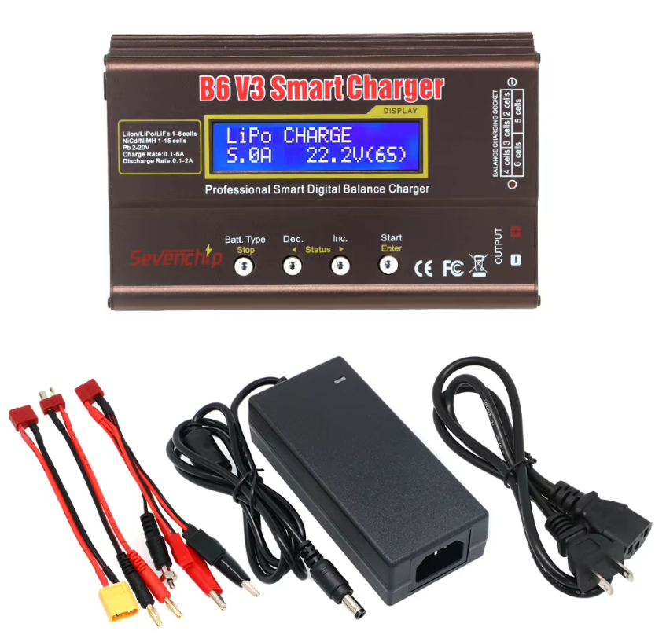
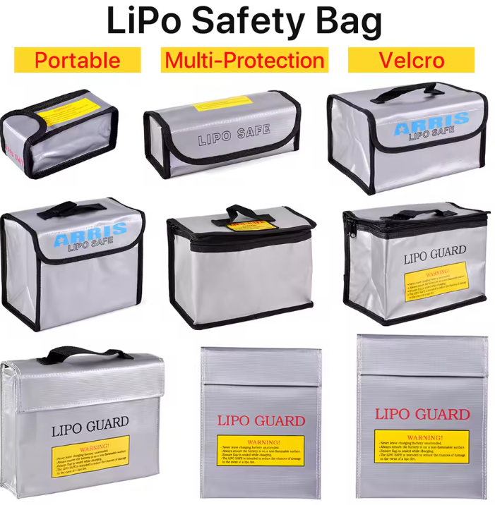

# 🔋 Alimentação

A alimentação dos robôs é feita por baterias de **lítio polímero (LiPo)**. Cada célula dessas baterias fornece uma tensão que varia de **3,3V a 4,2V**. Em geral, **uma única célula (1S)** não é suficiente para alimentar robôs da categoria mini sumô, então são utilizadas baterias de **2S ou 3S**, onde o **"S" indica células ligadas em série**.

Por exemplo:
- Uma bateria **2S** varia de **6,6V (2×3,3V)** a **8,4V (2×4,2V)**
- Uma bateria **3S** varia de **9,9V a 12,6V**

Embora as baterias possam descarregar abaixo de 3,3V por célula, **isso não é recomendado**, pois tensões muito baixas podem **danificá-las permanentemente**.

---

### ⚠️ Dica importante:
Monitore sempre a **tensão total da bateria** e também a **tensão individual de cada célula**. Isso é importante por dois motivos:
1. **Evitar danos** à bateria mantendo-a na faixa saudável (3,3V a 4,2V por célula).
2. **Desempenho**: quanto menor a tensão, menos energia está disponível para o robô, o que afeta diretamente a sua competitividade.

💡 **Tenha baterias reservas** para trocas rápidas durante competições!

---

### ⚙️ Tabela de referência por categoria

| Categoria    | Nº de Células (S) | Capacidade Comum |
|--------------|------------------:|------------------:|
| Nano sumô    | 1S ~ 2S           | ~60 mAh           |
| Micro sumô   | 2S ~ 3S           | ~150 mAh          |
| Mini sumô    | 2S ~ 4S           | ~330 mAh          |
| Mega sumô    | 6S ~ 12S          | Variável          |

---

### 🔌 Tipos de conectores

As baterias LiPo geralmente utilizam dois tipos de conectores:

- **Conector de potência**: responsável por fornecer energia ao robô. Exemplos:
  - JST
  - XT30 / XT60
  - Molex (em robôs menores)

- **Conector de balanceamento**: possui um fio para cada célula da bateria, permitindo que carregadores balanceiem as tensões individualmente. Muito importante para segurança e longevidade.

---

### 🔋 Carregadores e balanceamento

Use **carregadores balanceados específicos para LiPo**. Eles garantem que todas as células sejam carregadas uniformemente, evitando sobrecarga em uma célula e subcarga em outra.

> ⚠️ **Nunca use carregadores improvisados** ou genéricos que não tenham controle de carga e balanceamento. Baterias LiPo podem pegar fogo se carregadas incorretamente.

### IMAX B6 V3 - Recomendação de carregador

O carregador é uma otima opção de baixo custo. Carrega varios tipos de baterias LiPo, LiIon, NiCd etc. pode carregar baterias de LiPo de até 6S. Possui varios modos de carregamento inclusive o modo com balanceamento que é o ideal.

---

### 🛑 Cuidados no armazenamento

- Armazene as baterias em **local fresco e seguro**, longe de objetos inflamáveis.
- Se possível, guarde dentro de **sacos ou caixas antichamas** (LiPo Safe).
- Para longos períodos sem uso, carregue até a **tensão de armazenamento (cerca de 3,8V por célula)**.
- Nunca perfure ou amasse uma bateria. Se houver inchaço ou vazamento, **descarte com segurança**.

Use **LiPo sacks**, são bolsas a prova de chamas ideias para armazenar baterias desse tipo.

---

### ⚡ Taxa de descarga – o que é o "C"?

A letra **C** representa a **taxa de descarga máxima da bateria**, e indica quanta corrente a bateria pode fornecer com segurança.  
Essa taxa está sempre relacionada à **capacidade da bateria (em mAh)**. Para calcular a corrente máxima de descarga:

> **Corrente máxima (A) = Capacidade Maxima × C**

**Exemplo:**  
Uma bateria de **330 mAh (0,33 Ah)** $\text{C}=0,33A$. Se ela é **25C** pode fornecer até:

> **0,33 × 25 = 8,25 A**

Se o seu robô exige picos de corrente altos (como ao travar motor ou em rampagem), você deve escolher uma bateria com **C elevado** para evitar queda de tensão e superaquecimento.

---

### ⚖️ Capacidade vs Peso – o equilíbrio ideal

Uma bateria com maior **capacidade (mAh)** armazena mais energia, o que pode dar mais autonomia ao robô — mas também **aumenta o peso**, o que pode atrapalha a distribuição de peso do robô e o espaço.

Em competições de sumô, raramente o consumo é tão alto a ponto de exigir baterias grandes. Muitas vezes, usar uma bateria **menor, leve e com alta taxa de descarga (C)** é mais vantajoso do que priorizar autonomia. Os rounds são muito rápidos geralmente!

---

### ⚙️ Estimativa de Peso

A **densidade de energia** relaciona o peso com a energia armazenada. Para baterias LiPo pequenas, como as usadas em robôs de sumô, uma boa estimativa prática é:

> **Coeficiente estimado: 0,026 g/(S·mAh)**

Ou seja:

$$
\text{massa (g)} \approx 0{,}026 \times S \times C
$$

Onde:  
- \( S \) = número de células  
- \( C \) = capacidade da bateria em **mAh**

---

### 🧮 Exemplo de cálculo 

- Uma bateria 2S de 330 mAh:  
  $ 0{,}026 \times 2 \times 330 = \textbf{17{,}16\ g}$

---

| Capacidade | Células (S) | Cálculo estimado             | Peso aproximado |
|------------|-------------|------------------------------|-----------------|
| 150 mAh    | 1S          | 0,026 × 1 × 150 = **3,9 g**   | ~4 a 5 g        |
| 330 mAh    | 2S          | 0,026 × 2 × 330 = **17,2 g**  | ~17 a 18 g      |
| 500 mAh    | 3S          | 0,026 × 3 × 500 = **39 g**    | ~38 a 40 g      |

> 💡 Esses valores são apenas estimativas médias. O peso real pode variar conforme o modelo, especialmente em baterias com invólucros reforçados, cabos mais grossos ou sistemas de proteção integrados. Além disso, os coeficientes podem mudar de acordo com o método de fabricação adotado por cada fabricante.