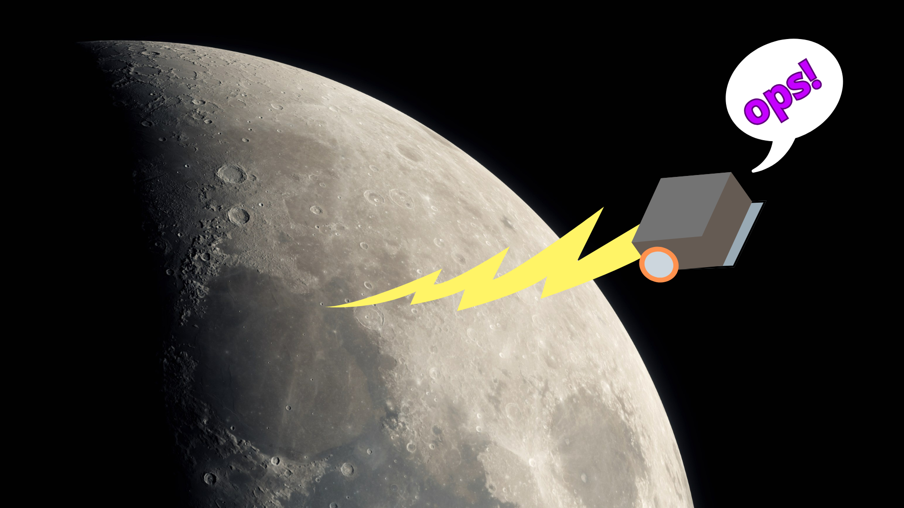
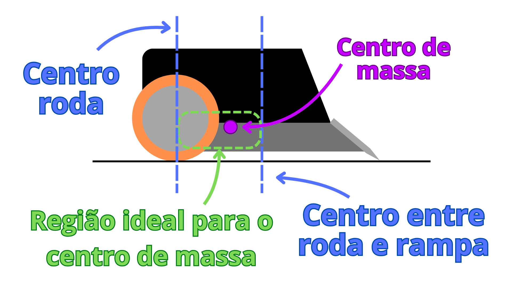

# Estrutura

A estrutura é responsável por manter todas as peças do robô no lugar, suportar o impactos durante os combates e contribuir para o equilíbrio e desempenho. Ela também influencia diretamente o **centro de massa (CM)** — um dos fatores mais importantes na dinâmica do robô.

---

## ⚖️ Equilíbrio dinâmico do robô

Vamos analisar o equilíbrio dinâmico do robô considerando que ele anda em linha reta, com as duas rodas girando à mesma velocidade e **sem empinar**.

As equações básicas são:  

$$
mg = N_{\text{rodas}} + N_{\text{lâmina}} \tag{1}
$$

$$
ma = F_{\text{rodas}} - F_{\text{lâmina}} \tag{2}
$$

$$
0 = N_{\text{lâmina}}W + ma z_{\text{CM}} - mg x_{\text{CM}} \tag{3}
$$

**Onde:**

- $N$: força normal  
- $m$: massa do robô  
- $g$: aceleração da gravidade  
- $F$: força horizontal (tração/atrito)  
- $W$: distância entre as rodas e a ponta da lâmina  
- $x_{\text{CM}}, z_{\text{CM}}$: coordenadas do centro de massa  
- $a$: aceleração linear do robô

---

## 🔍 O que aprendemos com isso?

1. A equação (1) nos diz que a **soma das normais** (rodas + lâmina) é igual ao peso do robô. O **ideal é balancear essa distribuição**:
   - Se toda a normal estiver nas **rodas**, o robô terá muita tração, mas poderá empinar e terá dificuldade em manter a lâmina rente ao chão.
   - Se a normal estiver concentrada na **lâmina**, haverá mais aderência frontal, mas o robô poderá ter **baixa tração nas rodas**, prejudicando a locomoção.

   Uma boa prática é manter **aproximadamente 70% da normal nas rodas** e **30% na lâmina**. Definindo $K_{\text{roda}}$ como a fração da força normal nas rodas:

   $$
   N_{\text{rodas}} = K_{\text{roda}} \cdot mg
   $$

   $$
   N_{\text{lâmina}} = (1 - K_{\text{roda}}) \cdot mg
   $$

   Substituindo na equação (3):

   $$
   K_{\text{roda}} = \left(1 - \frac{x_{\text{CM}}}{W}\right) + a \left(\frac{z_{\text{CM}}}{gW}\right)
   $$

Essa equação mostra como o **posicionamento** ($x_{\text{CM}}$) e a **altura** ($z_{\text{CM}}$) do centro de massa afetam a distribuição de peso (força normal) entre as rodas e a lâmina.

Quando o robô está acelerando ($a \ne 0$), a distribuição muda dinamicamente. É como se, no momento da arrancada, a **inércia puxasse o centro de massa para trás**, aliviando temporariamente a lâmina e transferindo mais peso para as rodas. Isso pode afetar a aderência da rampa ao chão e favorecer o empinamento, especialmente se o centro de massa estiver alto.

2. A equação (3) também nos ajuda a entender **quando o robô empina**. Se $N_{\text{lâmina}} = 0$, significa que a lâmina perdeu contato com o chão — ou seja, o robô empinou.

$$
mgx_{\text{CM}} = ma_{\text{limite}} z_{\text{CM}} \Rightarrow a_{\text{limite}} = g \cdot \frac{x_{\text{CM}}}{z_{\text{CM}}}
$$

Ou seja:  
👉 Quanto **menor a altura do centro de massa** ($z_{\text{CM}}$), **maior será a aceleração máxima permitida antes de empinar**. Ou seja, **centro de massa baixo = robô mais estável**.  

---

### 🌙 Curiosidade astrorrobótica  
A aceleração limite depende diretamente da gravidade.  
Isso significa que, **em uma competição na Lua** (onde $g$ é cerca de 6 vezes menor), os robôs **empinariam com muito mais facilidade** — bastaria uma aceleração bem menor pra tirar a rampa do chão. 😄🌕

> Moral da história: mantenha o centro de massa baixo — **aqui ou em qualquer planeta!**

### 📍 Dica prática de posicionamento do centro de massa (CM)

Como vimos anteriormente, o **centro de massa (CM)** tem papel fundamental na **estabilidade, tração e resistência ao empinamento** do robô. Um bom posicionamento do CM pode fazer toda a diferença no desempenho.

🔧 **Dica que costumo usar nos meus projetos:**  
- Posiciono a coordenada **$x_{\text{CM}}$** (profundidade) **entre o centro da roda e o ponto médio entre a roda e a lâmina**. Essa região tende a oferecer o melhor equilíbrio entre tração e estabilidade.
- Já a coordenada **$z_{\text{CM}}$** (altura) tento manter **igual ou menor que o centro da roda**.

📸 Ilustração do posicionamento recomendado:

---

### 📊 Tabela comparativa de materiais para chassi e Estrutura

| Material       | Densidade (g/cm³) | Dificuldade de Fabricação | Indicação de Uso                      | Observações                                                        | Preço Estimado (R$/kg) |
|----------------|--------------------|----------------------------|---------------------------------------|--------------------------------------------------------------------|------------------------|
| **Aço**        | 7,8 – 8,0          | Alta, usinagem           | Lastro ou chassi. | Muito resistente e difícil de usinar  | 8 – 15 |
| **Latão**      | 8,4 – 8,7          | Média, mais facil que aço mas depende de usinagem | Lastro ou chassi. |   | 30 – 50                |
| **Alumínio**   | 2,7                | Média, mais facil que aço mas depende de usinagem      | Chassi, mais rigido que materiais impressos, mas pode ser preciso complementar o peso com lastros. | | 20 – 40  |
| **Chumbo**     | 11,3 | Baixa. É bem macio, sendo possivel cortar com um alicate                      | Lastro  | tóxico — usar com cuidado e jamais derreter de forma improvisada | 20 – 30 |
| **PLA (3D)**   | 1,24        | Baixa, Facilmente impresso em 3D | Protótipos | Fácil de imprimir, mas frágil e sensível ao calor | 70 – 90                |
| **PETG (3D)**  | 1,27  | Baixa, Facilmente impresso em 3D                | Estrutura, suportes, hubs etc. Pode ser usada para fazer o chassi, mas pode invergar com o tempo e precisa de lastros para reduzir o CM. | Boa resistência ao impacto, melhor que PLA em temperatura. Levemente fexivel, principalmente em seções finas. | 80 – 100 |
| **ABS (3D)**   | 1,03    | Baixa-media, Impresso em 3D mas depende de bons parâmetros de impressão | Estrutura, suportes, hubs etc. Pode ser usada para fazer o chassi, mas pode invergar com o tempo e precisa de lastros para reduzir o CM. | Mais resistente que PLA, pode deformar durante a impressão | 75 – 95  |

---

## Chassi e Estrutura

O chassi e a estrutura formam o esqueleto do robô. Juntos, eles garantem estabilidade, proteção, distribuição adequada de massa e sustentação dos componentes.

- O **chassi** é normalmente a base inferior, diretamente responsável pela **rigidez, resistência e posicionamento do centro de massa**.
- A **estrutura** (em geral, as laterais e parte superior) completa o conjunto, servindo de suporte para **sensores, placas e mecanismos**, e protegendo o robô durante as partidas.

---

### 🎯 Objetivos principais do chassi

- **Ser baixo e pesado:**  
  Quanto mais **baixo** e **pesado** for o chassi, **mais estável** será o robô. Isso ajuda a **reduzir o centro de massa**, tornando-o menos propenso a empinar durante acelerações ou colisões.

- **Ser rigido:**  
  Um chassi rígido evita que o robô **empenhe ou torça**, o que pode atrapalhar o **nivelamento da lâmina** e compromete a eficiência da rampagem.

---

### 🎯 Objetivos principais da estrutura

- **Acomodar sensores e componentes corretamente:**  
  Os sensores devem estar bem posicionados, com visibilidade adequada, sem obstruções, e firmemente fixados para evitar erros de leitura.

- **Fixar as peças com segurança:**  
  Nenhum componente pode se soltar durante a partida. De acordo com regras comuns, **caso o robô perca peças com mais de 10 g no total** perde o round.

- **Proteger o robô e facilitar manutenção:**  
  A estrutura também atua como proteção contra pancadas e deve permitir acesso fácil aos componentes para manutenção entre lutas.

- **Atingir o peso da categoria:**  
  Em muitos casos, a estrutura também é usada para **adicionar massa estratégica** (como barras de chumbo), ajudando a alcançar o peso ideal e aumentar a tração nas rodas.

---

### 🛠️ Abordagens comuns de construção

#### Chassi de metal usinado + estrutura lateral impressa

Uma das abordagens mais equilibradas: usa um **chassi metálico usinado (Alumínio, Aço, Latão...)** na base, garantindo rigidez e densidade, enquanto as **estruturas laterais são impressas em 3D**, facilitando alterações no projeto.

✅ Vantagens:
- Boa rigidez e baixo centro de massa.
- Facilidade de alteração de sensores, controladoras e outros componentes sem refazer todo o chassi.

---

#### 🔧 Chassi totalmente metálico usinado

Todo o chassi é feito em metal (usualmente Alumínio ou Aço), garantindo um **baixo centro de massa** e geralmente chegando próximo ao **peso máximo permitido da categoria**, oque é bom e funcionam muito bem.

⚠️ Desvantagens:
- Custo mais alto.
- Alterações no projeto podem exigir nova usinagem — o que pode ser muito incoveniente e custoso.

  
[Fonte](https://www.jsumo.com/rem-premium-mini-sumo-robot-chassis)

---

#### 🖨️ Chassi e estrutura totalmente impressos

Essa é a opção mais acessível e versátil, ideal para quem está começando ou quer desenvolver rápido ou não quer gastar muito. O chassi inteiro é feito em **impressora 3D**, geralmente com PETG ou ABS.

👍 Funcionam muito bem — eu mesmo uso assim em vários projetos.  
⚠️ Com o tempo, o chassi pode **empenar com o uso**, sendo necessário reimprimir.

Outro ponto é que o chassi impresso sozinho **geralmente não atinge o peso da categoria**, então é necessário adicionar **lastros** (barras de chumbo ou latão, por exemplo).

  
[Projeto aberto de estrutura impressa](https://www.thingiverse.com/thing:4082009)

---

### 📌 Resumo

- Um bom chassi é **baixo, rígido e bem balanceado**.
- Reduzir o **$z_{\text{CM}}$** (altura) e manter o **$x_{\text{CM}}$** próximo à lâmina aumenta o desempenho e previne empinamentos.
- A estrutura e a distribuição de massa andam lado a lado na performance do robô.

💡 Dica: experimente combinar materiais — como base metálica + estrutura impressa — para o melhor dos dois mundos: desempenho e flexibilidade.